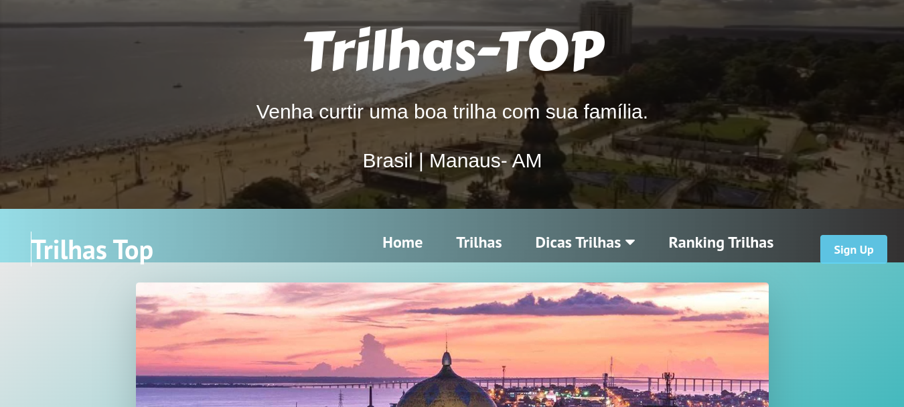
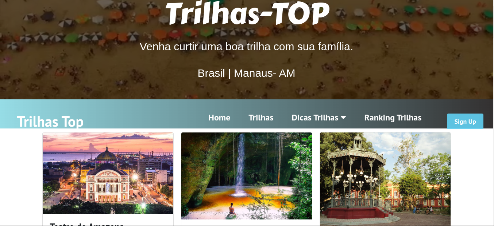
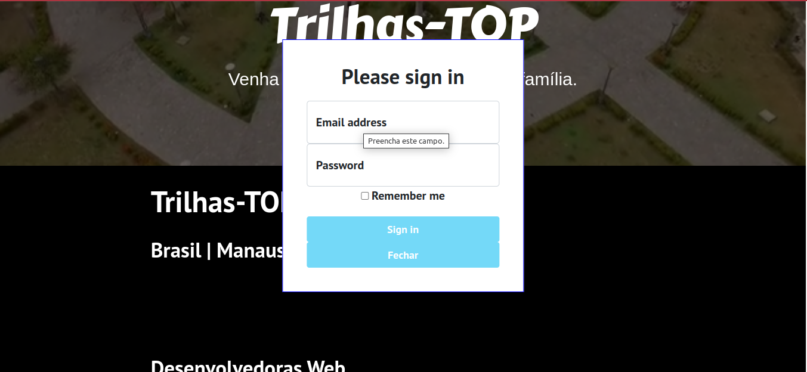
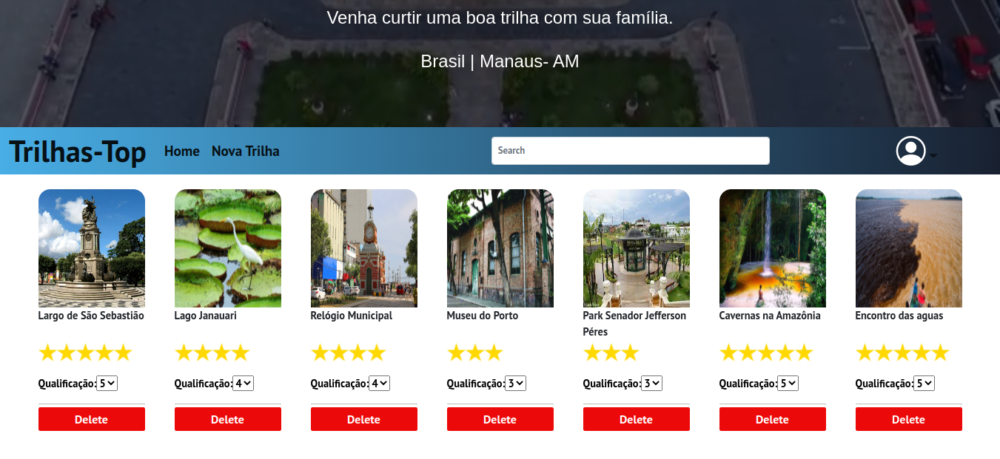

# TRILHAS TOP
É uma interface de fácil navegação, onde o usuário pode encontrar informações sobre pontos turísticos de Manaus.

## Sobre
Este projeto foi realizado com o objetivo de colocar em pratica os conhecimentos otidos no curso da Toti Diverdidade, utilizando html5, css3, bootstrap, react, api fake. 

## Execução
Para inicializar o projeto, e necessario acesar ao Api atraves da terminal com o siguente comando:
-npm rum api

Depois em outra aba do terminal colocamos o siguente:
-npm start

Por ultimo o projeto e aberto no browser!

# Funcionalidaes

## Ranking
Os usuários podem ter vontade de votar no local que mais gostam, colocando esse local no topo do ranking.

## Login
So aquelas pessoas logadas podem acesar nesta secao.

O admin pode criar o eliminar um ponto turistico.
